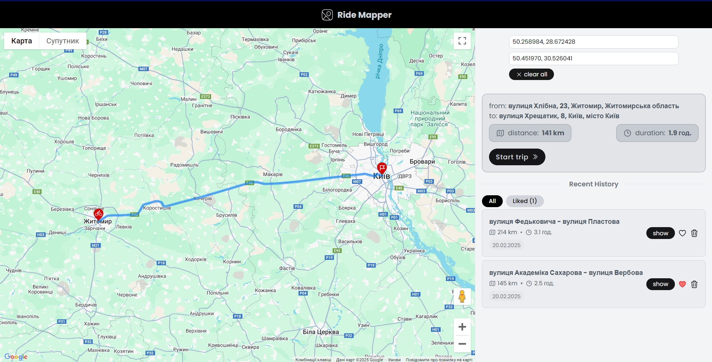

<!-- PROJECT SHIELDS -->
[![Contributors][contributors-shield]][contributors-url]
[![Forks][forks-shield]][forks-url]
[![Stargazers][stars-shield]][stars-url]
[![Issues][issues-shield]][issues-url]

<!-- ABOUT THE PROJECT -->

## About The Project

This system is designed for building, tracking, and saving routes efficiently. It provides an intuitive user interface
that ensures smooth navigation and an enhanced user experience.



Here's why:

* **User-friendly interface**
* **Route tracking**
* **Google Maps API integration**
* **State management with Pinia**

### Built With

The application was developed using these technologies:

* [![Vue][Vue.js]][Vue-url]
* [![TailwindCSS][Tailwindcss]][Tailwind-url]
* [![Pinia][Pinia.js]][Pinia-url]
* [![Google Maps API][GoogleMaps]][GoogleMaps-url]

<!-- GETTING STARTED -->

## Getting Started

A brief step-by-step guide to installing all dependencies to ensure the application runs correctly.

### Requirements

Before you begin, ensure your environment meets the following requirements:

- Node.js >= 21.x
- NPM >= 9.x

### Installation

1. Clone the repository to your local machine:
    ```bash
    git clone https://github.com/LashkayDaniel/ride-mapper.git
    ```

2. Navigate to the project directory:
    ```bash
    cd ride-mapper
    ```

3. Install JavaScript dependencies using NPM:
    ```bash
    npm install
    ```

4. Start the development server:
    ```bash
    npm run dev
    ```

6. Open your browser and go to `http://localhost:5173`.

<!-- MARKDOWN LINKS & IMAGES -->

[contributors-shield]: https://img.shields.io/github/contributors/LashkayDaniel/ride-mapper.svg?style=for-the-badge

[contributors-url]: https://github.com/LashkayDaniel/ride-mapper/graphs/contributors

[forks-shield]: https://img.shields.io/github/forks/LashkayDaniel/ride-mapper?style=for-the-badge

[forks-url]: https://github.com/LashkayDaniel/ride-mapper/network/members

[stars-shield]: https://img.shields.io/github/stars/LashkayDaniel/ride-mapper.svg?style=for-the-badge

[stars-url]: https://github.com/LashkayDaniel/ride-mapper/stargazers

[issues-shield]: https://img.shields.io/github/issues/LashkayDaniel/ride-mapper.svg?style=for-the-badge

[issues-url]: https://github.com/LashkayDaniel/ride-mapper/issues

[Vue.js]: https://img.shields.io/badge/Vue.js-35495E?style=for-the-badge&logo=vuedotjs&logoColor=4FC08D

[Vue-url]: https://vuejs.org/

[Pinia.js]: https://img.shields.io/badge/Pinia-FFD700?style=for-the-badge&logo=pinia&logoColor=black

[Pinia-url]: https://pinia.vuejs.org/

[Tailwindcss]: https://img.shields.io/badge/TailwindCSS-00BCFF?style=for-the-badge&logo=tailwindcss&logoColor=white

[Tailwind-url]: https://tailwindcss.com/

[GoogleMaps]: https://img.shields.io/badge/Google%20Maps%20API-4285F4?style=for-the-badge&logo=googlemaps&logoColor=white

[GoogleMaps-url]: https://developers.google.com/maps
